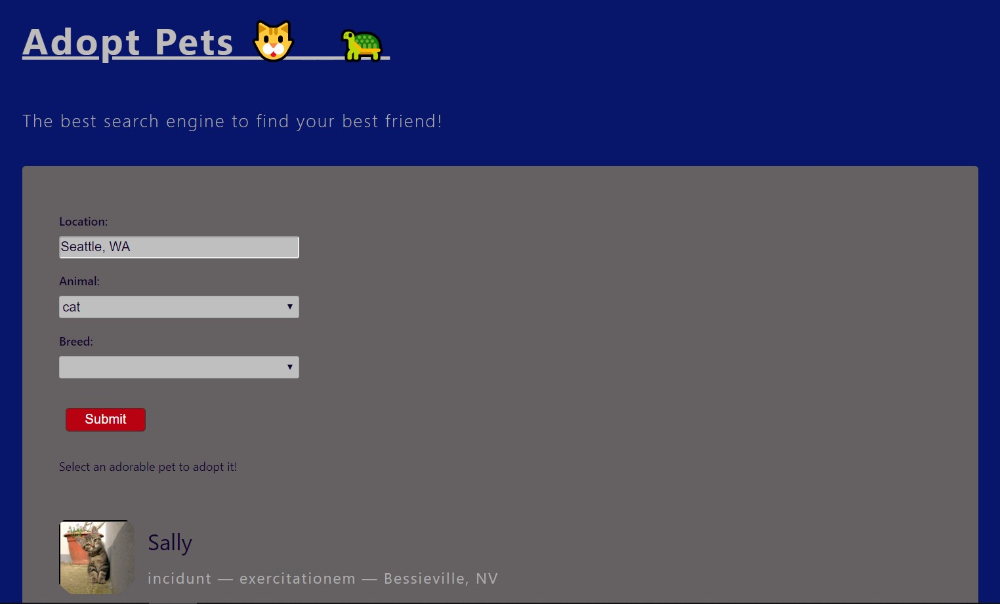

# Adopt__Pets 🐱🐢

## Introduction

Web to search animals from locality (only USA), animal and breed. You can click an animal and see it's information and photos and user can click to adopt it.

(The Petfinder API was updated to v2, and the v1 API (used in this course) was deprecated. The Petfinder Client API library was updated to return hardcoded, mock results to simulate the Petfinder API live response.)

## Available scripts for development

In the project directory, you can run:

npm run dev

## Technologies

React.js & Js